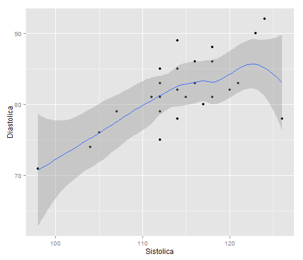

Presión Sanguinea
========================================================
### P. Giráldez M.

 A continuación representamos la presión sanguinea tomada durante una semana mañana y noche:


```r
load("C:/Users/pgiraldez/Documents/R/Preassure.RData")
summary(Preassure)
```

```
##             Fecha      Sistolica     Diastolica  
##  06/09/13 22:00: 1   Min.   : 98   Min.   :71.0  
##  07/09/13 10:00: 1   1st Qu.:112   1st Qu.:79.0  
##  07/09/13 23:00: 1   Median :114   Median :81.0  
##  08/09/13 10:00: 1   Mean   :114   Mean   :81.8  
##  08/09/13 21:00: 1   3rd Qu.:118   3rd Qu.:85.0  
##  09/09/13 08:00: 1   Max.   :126   Max.   :92.0  
##  (Other)       :21
```


Este es el gráfico asociado:


```r

library(ggplot2)
g <- ggplot(Preassure, aes(Sistolica, Diastolica))
g + geom_point() + geom_smooth(method = "loess")
```

 


